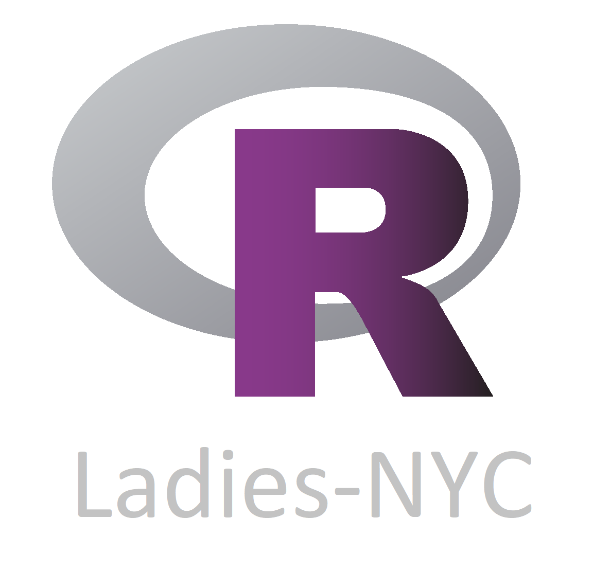

<link rel="stylesheet" href="styles.css" type="text/css">

R-Ladies is a world-wide organization to promote gender diversity in the R community. We are the NYC chapter of the global organization. R-Ladies NYC hosts a variety of events throughout the year, inlcuding talks, workshops, book clubs, data dives, and socials. Want to give a talk at an R-Ladies NYC meetup, or have an idea for an event? Email us at <nyc@rladies.org>.

Check out our [Meetup](https://www.meetup.com/rladies-newyork/) page to join and for more information about past and future events.

### Upcoming events

Our **final event of 2017** is on December 12, 2017 where Erin Grand will talk about how R is used in the Education World. 
[Register here](https://www.meetup.com/rladies-newyork/events/245064725/)

Help us choose a book for the January 2018 book club by completing this survey:

<iframe src="https://docs.google.com/forms/d/e/1FAIpQLSc6H41smC3tcWUyra5Lj2RnTb_rH-cJGQDyux-yrpLecXxfJg/viewform?embedded=true" width="600" height="875" frameborder="0" marginheight="0" marginwidth="0" style="-webkit-transform:scale(0.95);-moz-transform-scale(0.95);">Loading...</iframe>
